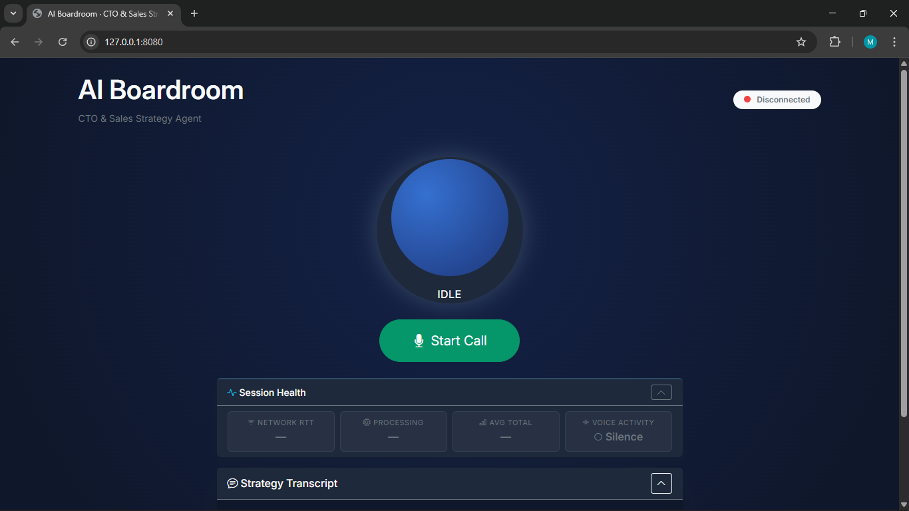

# AI Boardroom

A real-time voice assistant interface powered by **Voice.AI** and **LiveKit**, with a FastAPI backend and a dark-theme browser frontend.


---

## Architecture

```
Browser (mic + speaker)
    │
    │  WebSocket  /api/voice/stream
    ▼
FastAPI Backend
    │
    │  LiveKit SDK  wss://at.voice.ai/rtc?access_token=…
    ▼
Voice.AI Agent (LiveKit room)
```

The backend joins the LiveKit room as a participant, bridges PCM audio between the browser and the agent, and forwards state/transcript/latency events back to the frontend.

---

## Project Structure

```
ai-boardroom/
├── app/
│   ├── api/routes/
│   │   ├── health.py          # GET  /api/health
│   │   ├── voice_ai.py        # REST: agent-status, connection, end-call, sessions
│   │   ├── voice_stream.py    # WS   /api/voice/stream  (LiveKit bridge)
│   │   └── webhooks.py        # POST /api/webhooks/voice/* (wire up when ready)
│   ├── core/
│   │   └── config.py          # Settings loaded from .env
│   ├── services/
│   │   ├── session_manager.py # In-memory call session store
│   │   └── voice_ai_helper.py # Agent info cache
│   └── main.py
├── frontend/
│   ├── index.html
│   ├── app.js
│   └── styles.css
├── requirements.txt
└── run.py
```

---

## Setup

### 1. Create and activate a virtual environment

```bash
python -m venv .venv
# Windows
.venv\Scripts\activate
# macOS / Linux
source .venv/bin/activate
```

### 2. Install dependencies

```bash
pip install -r requirements.txt
```

### 3. Configure environment variables

Create a `.env` file in the project root:

```env
VOICE_AI_PUBLIC_KEY=your_voice_ai_api_key
ENVIRONMENT=development
PROJECT_NAME=AI Boardroom
```

### 4. Set your agent ID

Open `frontend/app.js` and update:

```javascript
const AGENT_ID = "your-agent-id-here";
```

### 5. Start the server

```bash
python run.py
```

Open `http://localhost:8080` in a modern browser (Chrome or Edge recommended for Web Audio API support).

---

## API Endpoints

| Method | Path | Description |
|--------|------|-------------|
| `GET` | `/api/health` | Liveness check |
| `GET` | `/api/voice/agent-status/{agent_id}` | Fetch agent info from Voice.AI |
| `POST` | `/api/voice/connection` | Get LiveKit room credentials |
| `POST` | `/api/voice/calls/{call_id}/end` | End a call |
| `GET` | `/api/voice/sessions/{session_id}` | Debug: inspect a session |
| `WS` | `/api/voice/stream` | LiveKit audio bridge |
| `GET` | `/api/config` | Public config for the frontend |

---

## Frontend Features

- **State machine** — `idle → connecting → live → listening → thinking → speaking → error`
- **LiveKit audio bridge** — PCM-16 at 48 kHz, float32→int16 conversion server-side
- **Voice Activity Detection (VAD)** — energy-based, only streams PCM when speech detected
- **Interruptible AI** — user speech cancels playing TTS immediately
- **Streaming transcript** — partial token bubbles with blinking cursor, committed on final message
- **Session Health dashboard** — live network RTT (ping/pong), processing latency, VAD status
- **Sticky session reconnect** — exponential backoff with `session_id` preserved for resume
- **Orb animations** — distinct states for idle, listening, thinking, speaking
- **Mic amplitude visualisation** — orb scales with input RMS

---

## WebSocket Protocol

### Browser → Backend

| Frame | Description |
|-------|-------------|
| JSON handshake | `{ server_url, participant_token, call_id, session_id, reconnect }` |
| Binary | PCM-16 mono 48 kHz mic audio (VAD-gated) |
| `{ type: "ping" }` | Latency probe |
| `{ type: "interrupt" }` | Cancel AI speech |

### Backend → Browser

| Frame | Description |
|-------|-------------|
| Binary | PCM-16 mono 48 kHz agent audio |
| `{ type: "pong" }` | Ping reply |
| `{ type: "state", state }` | `listening` / `thinking` / `speaking` |
| `{ type: "partial", sender, text }` | Streaming transcript token |
| `{ type: "message", sender, text }` | Final transcript message |
| `{ type: "latency", latency }` | Processing latency in ms |

---

## Webhooks (optional)

`webhooks.py` is included but not wired up by default. To enable:

1. Add to `main.py`:
   ```python
   from app.api.routes import webhooks
   app.include_router(webhooks.router, prefix="/api", tags=["Webhooks"])
   ```
2. Set your webhook URL in the Voice.AI dashboard to `https://your-domain/api/webhooks/voice/transcript` and `/call-ended`.

---

## License

Proprietary — use within your organisation only.