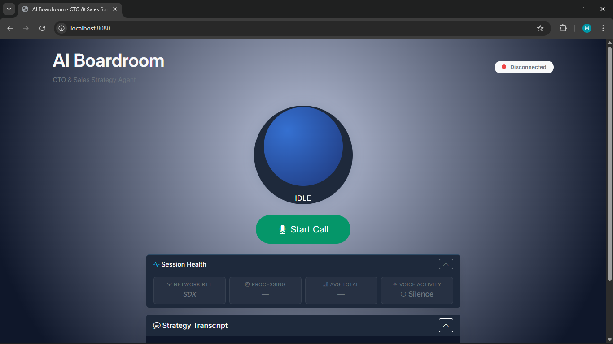
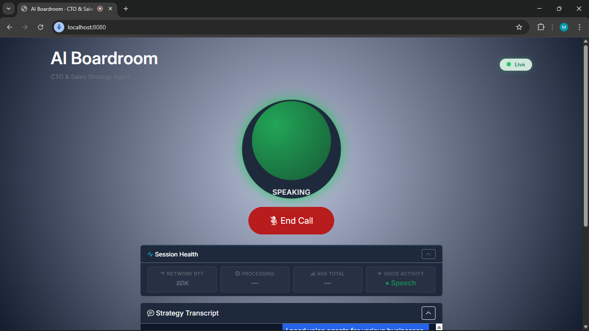

# AI Boardroom

A real-time AI voice agent interface powered by **Voice.AI** and the **Voice.AI Web SDK**, with a FastAPI backend and a dark-theme browser frontend.

## 🖼️ Snapshots

| IDLE | LIVE |
|---|---|
| |  |

---

## Architecture

```
Browser (mic + speaker)
    │
    │  REST  /api/voice/connection  ← get credentials (API key stays server-side)
    ▼
FastAPI Backend  ──►  Voice.AI REST API
    │
    │  credentials (server_url, participant_token, end_token)
    ▼
Browser
    │
    │  Voice.AI Web SDK  (LiveKit room, direct)
    ▼
Voice.AI Agent
```

The backend's only job is to hold the API key and exchange it for short-lived connection credentials. The browser SDK then connects directly to the Voice.AI agent — mic, audio, VAD, interruptions, and transcription are all handled natively by the SDK.

---

## Project Structure

```
ai-boardroom/
├── app/
│   ├── api/routes/
│   │   ├── health.py          # GET  /api/health
│   │   ├── voice_ai.py        # REST: agent-status, connection, end-call, sessions
│   │   └── webhooks.py        # POST /api/webhooks/voice/* (wire up when ready)
│   ├── core/
│   │   └── config.py          # Settings loaded from .env
│   ├── services/
│   │   ├── session_manager.py # In-memory call session store
│   │   └── voice_ai_helper.py # Agent info cache
│   └── main.py
├── assets/
│   └── voice.ai-agent.png
├── frontend/
│   ├── index.html
│   ├── app.js                 # Voice.AI Web SDK integration
│   └── styles.css
├── .gitignore
├── README.md
├── requirements.txt
└── run.py
```

---

## Setup

### 1. Create and activate a virtual environment

```bash
python -m venv .venv
# Windows
.venv\Scripts\activate
# macOS / Linux
source .venv/bin/activate
```

### 2. Install dependencies

```bash
pip install -r requirements.txt
```

### 3. Configure environment variables

Create a `.env` file in the project root:

```env
VOICE_AI_PUBLIC_KEY=your_voice_ai_api_key
ENVIRONMENT=development
PROJECT_NAME=AI Boardroom
```

### 4. Set your agent ID

Open `frontend/app.js` and update:

```javascript
const AGENT_ID = "your-agent-id-here";
```

### 5. Start the server

```bash
python run.py
```

Open `http://localhost:8080` in Chrome or Edge (required for Web Audio API and ESM module support).

---

## API Endpoints

| Method | Path | Description |
|--------|------|-------------|
| `GET` | `/api/health` | Liveness check |
| `GET` | `/api/voice/agent-status/{agent_id}` | Fetch agent info from Voice.AI |
| `POST` | `/api/voice/connection` | Get session credentials |
| `POST` | `/api/voice/calls/{call_id}/end` | End a call |
| `GET` | `/api/voice/sessions/{session_id}` | Debug: inspect a session |
| `GET` | `/api/config` | Public config for the frontend |

---

## Frontend Features

- **Voice.AI Web SDK** — direct browser-to-agent connection, no audio bridge needed
- **State machine** — `idle → connecting → live → listening → thinking → speaking → error`
- **Streaming transcript** — partial token bubbles with blinking cursor, committed on final message
- **Session Health dashboard** — processing latency, VAD status via SDK audio level events
- **Exponential backoff** — up to 3 retries with countdown
- **Orb animations** — distinct states for idle, listening, thinking, speaking
- **Mic amplitude visualisation** — orb scales with SDK audio level
- **Concurrency slot management** — `endToken` passed to SDK on disconnect, frees slot immediately

---

## Agent Configuration

Voice, VAD, interruptions, and timing are configured on the agent in the Voice.AI dashboard — not in the frontend code. Key parameters:

```json
{
  "config": {
    "prompt": "You are a CTO and Sales Strategy advisor...",
    "tts_params": { "voice_id": "your-cloned-voice-id" },
    "allow_interruptions": true,
    "min_interruption_words": 1,
    "vad_activation_threshold": 0.5,
    "min_silence_duration": 0.55
  }
}
```

To create persona variations, update `AGENT_ID` in `app.js` — the entire stack serves any agent without code changes.

---

## Webhooks (optional)

`webhooks.py` is included but not wired up by default. To enable:

1. Add to `main.py`:
   ```python
   from app.api.routes import webhooks
   app.include_router(webhooks.router, prefix="/api", tags=["Webhooks"])
   ```
2. Set your webhook URL in the Voice.AI dashboard to `https://your-domain/api/webhooks/voice/transcript` and `/call-ended`.

---

## License

Proprietary — use within your organisation only.